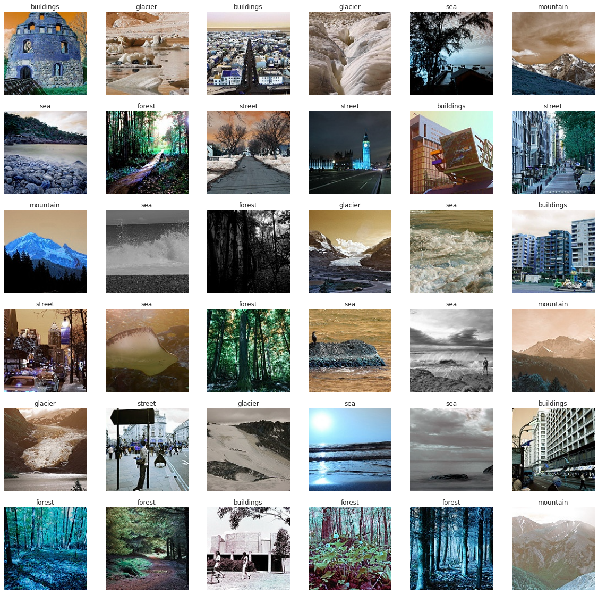
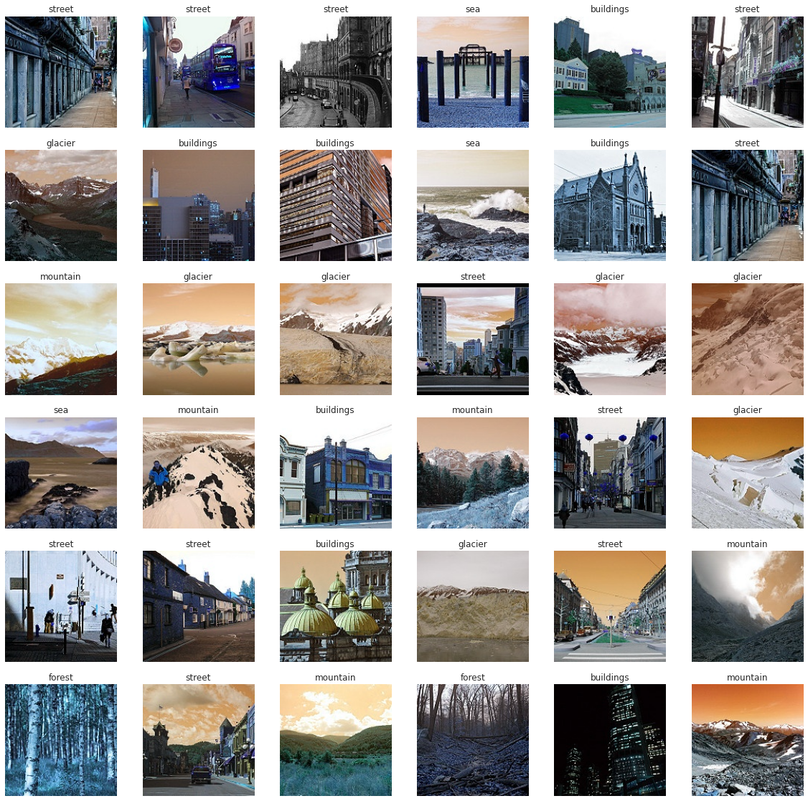
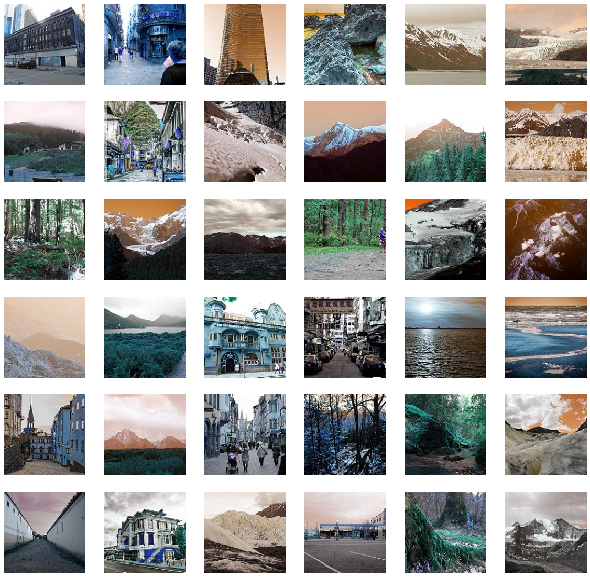
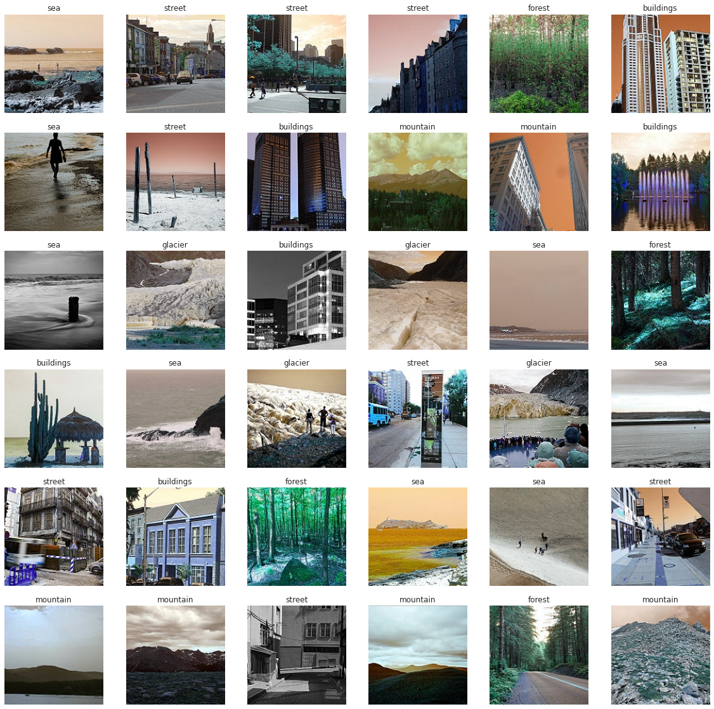

```python
# This Python 3 environment comes with many helpful analytics libraries installed
# It is defined by the kaggle/python Docker image: https://github.com/kaggle/docker-python
# For example, here's several helpful packages to load

#import numpy as np # linear algebra
#import pandas as pd # data processing, CSV file I/O (e.g. pd.read_csv)

# Input data files are available in the read-only "../input/" directory
# For example, running this (by clicking run or pressing Shift+Enter) will list all files under the input directory

#import os
#for dirname, _, filenames in os.walk('/kaggle/input'):
 #   for filename in filenames:
  #      print(os.path.join(dirname, filename))

# You can write up to 20GB to the current directory (/kaggle/working/) that gets preserved as output when you create a version using "Save & Run All" 
# You can also write temporary files to /kaggle/temp/, but they won't be saved outside of the current session
```


```python
import pandas as pd
import numpy as np
import matplotlib.pyplot as plt
%matplotlib inline
import seaborn as sns
sns.set(style="whitegrid")
import os
import glob as gb
import cv2
import tensorflow as tf
import keras
```


```python
trainpath = '../input/intel-image-classification/seg_train/'
testpath = '../input/intel-image-classification/seg_test/'
predpath = '../input/intel-image-classification/seg_pred/'
```


```python
for folder in os.listdir(trainpath+'seg_train'):
    files = gb.glob(pathname=str(trainpath+'seg_train//'+folder+'/*.jpg'))
    print(f'For training data , found {len(files)} in folder {folder}')

```

    For training data , found 2512 in folder mountain
    For training data , found 2382 in folder street
    For training data , found 2191 in folder buildings
    For training data , found 2274 in folder sea
    For training data , found 2271 in folder forest
    For training data , found 2404 in folder glacier
    


```python
for folder in os.listdir(testpath+'seg_test'):
    files = gb.glob(pathname=str(testpath+'seg_test//'+folder+'/*.jpg'))
    print(f'For testing data , found {len(files)} in folder {folder}')

```

    For testing data , found 525 in folder mountain
    For testing data , found 501 in folder street
    For testing data , found 437 in folder buildings
    For testing data , found 510 in folder sea
    For testing data , found 474 in folder forest
    For testing data , found 553 in folder glacier
    


```python
files = gb.glob(pathname= str(predpath +'seg_pred/*.jpg'))
print(f'For Prediction data , found {len(files)}')
```

    For Prediction data , found 7301
    


```python
code = {'buildings':0 ,'forest':1,'glacier':2,'mountain':3,'sea':4,'street':5}

def getcode(n) : 
    for x , y in code.items() : 
        if n == y : 
            return x
```


```python
size = []
for folder in  os.listdir(trainpath +'seg_train') : 
    files = gb.glob(pathname= str( trainpath +'seg_train//' + folder + '/*.jpg'))
    for file in files: 
        image = plt.imread(file)
        size.append(image.shape)
pd.Series(size).value_counts()
```


    (150, 150, 3)    13986
    (113, 150, 3)        7
    (135, 150, 3)        3
    (111, 150, 3)        3
    (136, 150, 3)        2
    (134, 150, 3)        2
    (108, 150, 3)        2
    (143, 150, 3)        2
    (142, 150, 3)        2
    (144, 150, 3)        2
    (123, 150, 3)        2
    (146, 150, 3)        2
    (115, 150, 3)        1
    (124, 150, 3)        1
    (81, 150, 3)         1
    (145, 150, 3)        1
    (103, 150, 3)        1
    (102, 150, 3)        1
    (147, 150, 3)        1
    (97, 150, 3)         1
    (120, 150, 3)        1
    (110, 150, 3)        1
    (76, 150, 3)         1
    (119, 150, 3)        1
    (141, 150, 3)        1
    (140, 150, 3)        1
    (149, 150, 3)        1
    (131, 150, 3)        1
    (100, 150, 3)        1
    (133, 150, 3)        1
    (105, 150, 3)        1
    dtype: int64


```python
size = []
for folder in  os.listdir(testpath +'seg_test') : 
    files = gb.glob(pathname= str( testpath +'seg_test//' + folder + '/*.jpg'))
    for file in files: 
        image = plt.imread(file)
        size.append(image.shape)
pd.Series(size).value_counts()
```


    (150, 150, 3)    2993
    (131, 150, 3)       1
    (149, 150, 3)       1
    (81, 150, 3)        1
    (141, 150, 3)       1
    (76, 150, 3)        1
    (110, 150, 3)       1
    (72, 150, 3)        1
    dtype: int64


```python
size = []
files = gb.glob(pathname= str( predpath +'seg_pred/*.jpg'))
for file in files: 
    image = plt.imread(file)
    size.append(image.shape)
pd.Series(size).value_counts()
```


    (150, 150, 3)    7288
    (131, 150, 3)       1
    (149, 150, 3)       1
    (143, 150, 3)       1
    (126, 150, 3)       1
    (108, 150, 3)       1
    (144, 150, 3)       1
    (374, 500, 3)       1
    (129, 150, 3)       1
    (112, 150, 3)       1
    (139, 150, 3)       1
    (133, 150, 3)       1
    (124, 150, 3)       1
    (100, 150, 3)       1
    dtype: int64


```python
s=150
```


```python
X_train = []
y_train = []
for folder in  os.listdir(trainpath +'seg_train') : 
    files = gb.glob(pathname= str( trainpath +'seg_train//' + folder + '/*.jpg'))
    for file in files: 
        image = cv2.imread(file)
        image_array = cv2.resize(image , (s,s))
        X_train.append(list(image_array))
        y_train.append(code[folder])
```


```python
print (f'{len(X_train)} img in training data')
```

    14034 img in training data
    


```python
plt.figure(figsize=(20,20))
for n , i in enumerate(list(np.random.randint(0,len(X_train),36))) : 
    plt.subplot(6,6,n+1)
    plt.imshow(X_train[i])   
    plt.axis('off')
    plt.title(getcode(y_train[i]))
```


    

    


```python

X_test = []
y_test = []
for folder in  os.listdir(testpath +'seg_test') : 
    files = gb.glob(pathname= str(testpath + 'seg_test//' + folder + '/*.jpg'))
    for file in files: 
        image = cv2.imread(file)
        image_array = cv2.resize(image , (s,s))
        X_test.append(list(image_array))
        y_test.append(code[folder])
```


```python
plt.figure(figsize=(20,20))
for n , i in enumerate(list(np.random.randint(0,len(X_test),36))) : 
    plt.subplot(6,6,n+1)
    plt.imshow(X_test[i])    
    plt.axis('off')
    plt.title(getcode(y_test[i]))
```


    

    


```python
X_pred = []
files = gb.glob(pathname= str(predpath + 'seg_pred/*.jpg'))
for file in files: 
    image = cv2.imread(file)
    image_array = cv2.resize(image , (s,s))
    X_pred.append(list(image_array))
```


```python
plt.figure(figsize=(20,20))
for n , i in enumerate(list(np.random.randint(0,len(X_pred),36))) : 
    plt.subplot(6,6,n+1)
    plt.imshow(X_pred[i])    
    plt.axis('off')
```


    

    


```python
X_train = np.array(X_train)
X_test = np.array(X_test)
X_pred_array = np.array(X_pred)
y_train = np.array(y_train)
y_test = np.array(y_test)

print(f'X_train shape  is {X_train.shape}')
print(f'X_test shape  is {X_test.shape}')
print(f'X_pred shape  is {X_pred_array.shape}')
print(f'y_train shape  is {y_train.shape}')
print(f'y_test shape  is {y_test.shape}')
```

    X_train shape  is (14034, 150, 150, 3)
    X_test shape  is (3000, 150, 150, 3)
    X_pred shape  is (7301, 150, 150, 3)
    y_train shape  is (14034,)
    y_test shape  is (3000,)
    


```python
KerasModel = keras.models.Sequential([
        keras.layers.Conv2D(200,kernel_size=(3,3),activation='relu',input_shape=(s,s,3)),
        keras.layers.MaxPool2D(3,3),
        keras.layers.Conv2D(120,kernel_size=(3,3),activation='relu'),
        keras.layers.MaxPool2D(2,2),
        keras.layers.Conv2D(120,kernel_size=(3,3),activation='relu'),
        keras.layers.MaxPool2D(2,2),
        keras.layers.Conv2D(80,kernel_size=(3,3),activation='relu'),    
        keras.layers.Conv2D(50,kernel_size=(3,3),activation='relu'),
        keras.layers.MaxPool2D(4,4),
        tf.keras.layers.BatchNormalization(),
        keras.layers.Flatten() ,    
        keras.layers.Dropout(rate=0.2),
        keras.layers.Dense(120,activation='relu') ,    
        keras.layers.Dense(100,activation='relu') ,    
        keras.layers.Dense(50,activation='relu') ,                    
        keras.layers.Dense(6,activation='softmax') ,    
        ])
```


```python
KerasModel.compile(optimizer ='adam',loss='sparse_categorical_crossentropy',metrics=['accuracy'])
```


```python
print('Model Details are : ')
print(KerasModel.summary())
```

    Model Details are : 
    Model: "sequential"
    _________________________________________________________________
    Layer (type)                 Output Shape              Param #   
    =================================================================
    conv2d (Conv2D)              (None, 148, 148, 200)     5600      
    _________________________________________________________________
    max_pooling2d (MaxPooling2D) (None, 49, 49, 200)       0         
    _________________________________________________________________
    conv2d_1 (Conv2D)            (None, 47, 47, 120)       216120    
    _________________________________________________________________
    max_pooling2d_1 (MaxPooling2 (None, 23, 23, 120)       0         
    _________________________________________________________________
    conv2d_2 (Conv2D)            (None, 21, 21, 120)       129720    
    _________________________________________________________________
    max_pooling2d_2 (MaxPooling2 (None, 10, 10, 120)       0         
    _________________________________________________________________
    conv2d_3 (Conv2D)            (None, 8, 8, 80)          86480     
    _________________________________________________________________
    conv2d_4 (Conv2D)            (None, 6, 6, 50)          36050     
    _________________________________________________________________
    max_pooling2d_3 (MaxPooling2 (None, 1, 1, 50)          0         
    _________________________________________________________________
    batch_normalization (BatchNo (None, 1, 1, 50)          200       
    _________________________________________________________________
    flatten (Flatten)            (None, 50)                0         
    _________________________________________________________________
    dropout (Dropout)            (None, 50)                0         
    _________________________________________________________________
    dense (Dense)                (None, 120)               6120      
    _________________________________________________________________
    dense_1 (Dense)              (None, 100)               12100     
    _________________________________________________________________
    dense_2 (Dense)              (None, 50)                5050      
    _________________________________________________________________
    dense_3 (Dense)              (None, 6)                 306       
    =================================================================
    Total params: 497,746
    Trainable params: 497,646
    Non-trainable params: 100
    _________________________________________________________________
    None
    


```python

epochs = 25
ThisModel = KerasModel.fit(X_train, y_train, epochs=epochs,batch_size=64)
```

    Epoch 1/25
    220/220 [==============================] - 1100s 5s/step - loss: 1.3388 - accuracy: 0.4492
    Epoch 2/25
    220/220 [==============================] - 1094s 5s/step - loss: 0.9076 - accuracy: 0.6418
    Epoch 3/25
    220/220 [==============================] - 1111s 5s/step - loss: 0.7754 - accuracy: 0.7018
    Epoch 4/25
    220/220 [==============================] - 1104s 5s/step - loss: 0.7162 - accuracy: 0.7323
    Epoch 5/25
    220/220 [==============================] - 1130s 5s/step - loss: 0.6632 - accuracy: 0.7546
    Epoch 6/25
    220/220 [==============================] - 1126s 5s/step - loss: 0.6173 - accuracy: 0.7706
    Epoch 7/25
    220/220 [==============================] - 1152s 5s/step - loss: 0.5700 - accuracy: 0.7813
    Epoch 8/25
    220/220 [==============================] - 1131s 5s/step - loss: 0.5673 - accuracy: 0.7939
    Epoch 9/25
    220/220 [==============================] - 1105s 5s/step - loss: 0.6266 - accuracy: 0.7638
    Epoch 10/25
    220/220 [==============================] - 1133s 5s/step - loss: 0.5177 - accuracy: 0.8125
    Epoch 11/25
    220/220 [==============================] - 1128s 5s/step - loss: 0.4872 - accuracy: 0.8233
    Epoch 12/25
    220/220 [==============================] - 1118s 5s/step - loss: 0.4571 - accuracy: 0.8302
    Epoch 13/25
    220/220 [==============================] - 1132s 5s/step - loss: 0.4378 - accuracy: 0.8407
    Epoch 14/25
    220/220 [==============================] - 1018s 5s/step - loss: 0.4104 - accuracy: 0.8457
    Epoch 15/25
    220/220 [==============================] - 1116s 5s/step - loss: 0.4091 - accuracy: 0.8519
    Epoch 16/25
    220/220 [==============================] - 1137s 5s/step - loss: 0.3531 - accuracy: 0.8727
    Epoch 17/25
    220/220 [==============================] - 1121s 5s/step - loss: 0.3322 - accuracy: 0.8813
    Epoch 18/25
    220/220 [==============================] - 993s 5s/step - loss: 0.3186 - accuracy: 0.8858
    Epoch 19/25
    220/220 [==============================] - 1028s 5s/step - loss: 0.3257 - accuracy: 0.8842
    Epoch 20/25
    220/220 [==============================] - 995s 5s/step - loss: 0.3060 - accuracy: 0.8937
    Epoch 21/25
    220/220 [==============================] - 987s 4s/step - loss: 0.2760 - accuracy: 0.8977
    Epoch 22/25
    220/220 [==============================] - 993s 5s/step - loss: 0.2552 - accuracy: 0.9113
    Epoch 23/25
    220/220 [==============================] - 982s 4s/step - loss: 0.2295 - accuracy: 0.9175
    Epoch 24/25
    220/220 [==============================] - 995s 5s/step - loss: 0.2452 - accuracy: 0.9128
    Epoch 25/25
    220/220 [==============================] - 981s 4s/step - loss: 0.1873 - accuracy: 0.9368
    


```python
ModelLoss, ModelAccuracy = KerasModel.evaluate(X_test, y_test)

print('Test Loss is {}'.format(ModelLoss))
print('Test Accuracy is {}'.format(ModelAccuracy ))
```

    94/94 [==============================] - 60s 639ms/step - loss: 0.6373 - accuracy: 0.8083
    Test Loss is 0.6373381614685059
    Test Accuracy is 0.8083333373069763
    


```python

```


```python
y_result = KerasModel.predict(X_pred_array)

print('Prediction Shape is {}'.format(y_result.shape))
```

    Prediction Shape is (7301, 6)
    


```python
plt.figure(figsize=(20,20))
for n , i in enumerate(list(np.random.randint(0,len(X_pred),36))) : 
    plt.subplot(6,6,n+1)
    plt.imshow(X_pred[i])    
    plt.axis('off')
    plt.title(getcode(np.argmax(y_result[i])))
```


    

    

